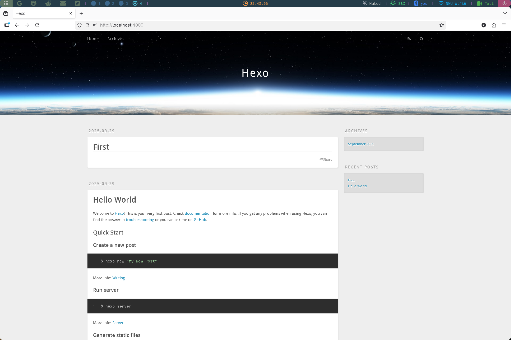
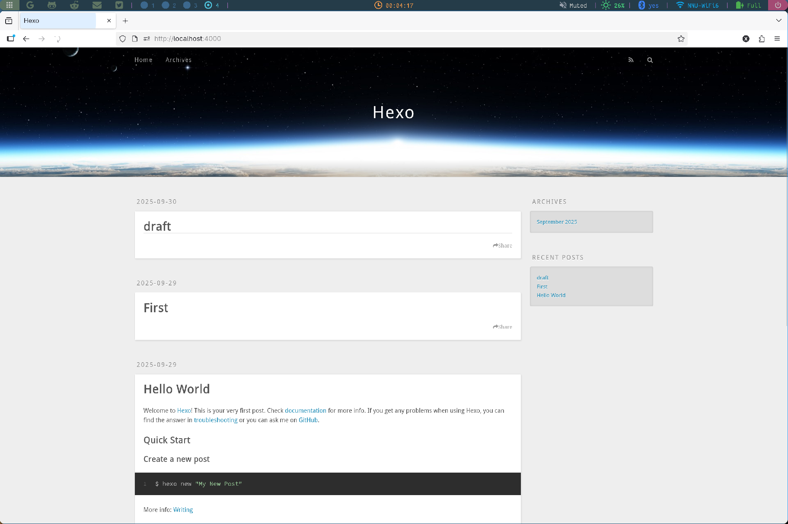

# [Hexo](https://hexo.io)的部署

## 安装

### nodejs

- ArchLinux(包管理器即可)
  ```sh
  sudo pacman -S nodejs npm
  ```
- Ubuntu/Deb系([NodeSource](https://nodesource.com/products/distributions))
  ```sh
  curl -fsSL https://deb.nodesource.com/setup_22.x | sudo -E bash -
  sudo apt-get install -y nodejs
  ```
- 安装完成后查看node与npm版本（node大概20+比较好应该）
  ```sh
  node -v
  npm -v
  ```

### 本体

直接npm安装

```sh
npm install -g hexo-cli
```

### 初始化

- init命令
  ```sh
  hexo init hexo
  ```
- npm install
  ```sh
  cd hexo
  npm install
  ```
- 完成后文件结构如下
  ```sh
  $ tree -d -L 1
  /path/to/hexo
  ├── node_modules
  ├── scaffolds
  ├── source
  └── themes
  ```

## 常用命令

### new

初始化完成后就可以开始进行写作了（先不用管其他乱七八糟的，抓住主要矛盾）<br>
命令形式：`hexo new [layout] <title>`（layout默认分为post、page、draft；默认值为post）<br>

- post
  ```sh
  hexo new "First"
  ```
  会创建文件/path/to/hexo/source/\_posts/First.md
- page
  ```sh
  hexo new page "About"
  ```
  创建文件/path/to/hexo/source/About/index.md<br>
  作用是创建一个新的页面。（私以为刚开始搞用处不大，本人放了一个用来放本站的[About](/about)）
- draft
  ```sh
  hexo new draft "draft"
  ```
  创建文件/path/to/hexo/source/\_drafts/draft.md<br>
  用以存放尚未完成的文章。在生成静态网页时\_drafts/下的.md文件不会被渲染为网页。

### generate

到此你已经会在hexo的目录下写文章了，就到了最重要的md->html环节。<br>

```sh
hexo generate
//或者
hexo g
```

之后终端会告诉你生成了具体哪些文件，这些文件都存放在/path/to/hexo/public中，这个public就是博客网站的根目录。结构如此：

```sh
/path/to/hexo/public
├── 2025
├── About
├── archives
├── css
├── fancybox
└── js
```

生成的文章会以时间为分类依据保存。同时如果.md中有设置标签则还会多处categories这一目录

### server

接下来是快速检验自己的网站效果的步骤。

```sh
hexo server
//或者
hexo s
```

启动hexo服务器。在浏览器打开网址输入http://localhost:4000或者127.0.0.1:4000<br>
可以看到网页如下：


### publish

将\_drafts/下的草稿发布为\_posts/下的文章。

```sh
hexo publish draft
```

/path/to/hexo/source/\_drafts/draft.md移到/path/to/hexo/source/\_posts/draft.md<br>
此时再hexo g则会将draft.md一并渲染为网页并存入/public中，之后再次hexo s则可以看到网页变化：

发现多了一篇文章名为draft

### deploy

```sh
hexo deploy
//或者
hexo d
```

用于将本地hexo项目generate之后的/public整体同步到用于部署网页的服务端；可以是Github Pages等托管平台，也可以是自己的[nginx服务器](#服务器nginx部署)<br>
deploy需要在hexo项目根目录下的\_config.yml中进行[配置](#_config.yml)<br>

### 实际使用

实际使用过程中以下操作比较常见

```sh
hexo new <Title>          //新建文章
hexo new draft <Title>    //新建草稿
hexo publish <Title>      //发布草稿
hexo g && hexo s          //本地服务测试
hexo g -d                 //生成静态页面并部署
```

#### githubPage部署

- 待完成。我没用这个，以后再说吧

#### 服务器nginx部署

# 选择主题

## hingle

## 配置文件概述

### \_config.yml

### public

### source

### themes

#### layout

#### source

# 评论区配置

## Waline

## Giscus

## Valine

# 域名与服务器

## 域名托管

## 服务器

### VPS

### 端口映射
